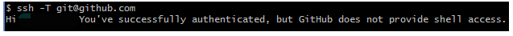

# 使用ssh key与GitHub建立连接
## 生成ssh key
ssh-keygen -t rsa -b 4096 -C 自己的邮箱

cat ~/.ssh/id_rsa.pub 获得公钥的内容

进入settings，选择ssh key选项把复制的公钥粘贴进来

## 测试是否配对成功
ssh -T git@github.com 有提问 yes并回车

 如果看到下图则说明配对成功
 